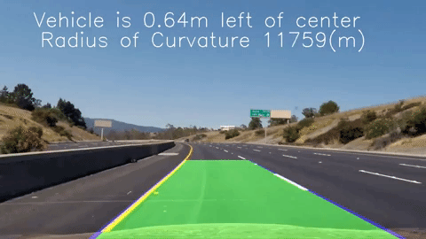
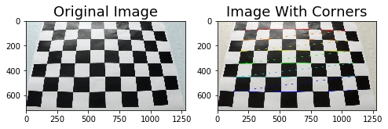
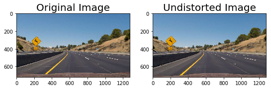
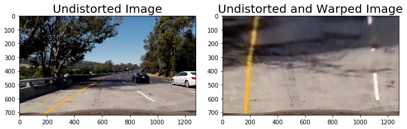
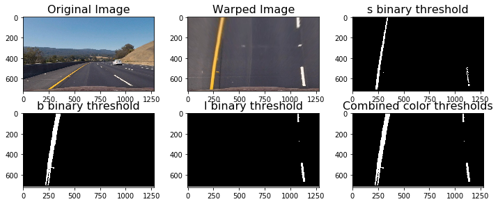
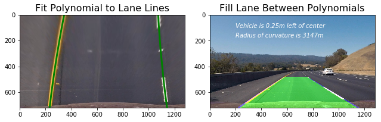

# Project 4: Advanced Lane Line Detection



## Project Goals

The goal of this project is to develop a pipeline to process a video stream from the center camera of a car and output an annotated video which identifies:

1. The positions of the lane lines
2. The location of the vehicle relative to the center of the lane
3. The radius of curvature of the road

The steps that I followed in this project are the following:

**Step 1:** Apply distortion correction using a calculated camera calibration matrix and distortion coefficients.    
**Step 2:** Apply a perspective transformation to warp the image to a birds eye view perspective of the lane lines.    
**Step 3:** Apply color thresholds to create a binary image which isolates the pixels representing lane lines.      
**Step 4:** Identify the lane line pixels and fit polynomials to the lane boundaries.              
**Step 5:** Determine curvature of the lane and vehicle position with respect to center.         
**Step 6:** Warp the detected lane boundaries back onto the original image.                
**Step 7:** Output visual display of the lane boundaries and estimation of lane curvature and vehicle position.         
**Step 8:** Build a video processing pipeline with all the above steps         

I have used the following software/libraries in this project

1. Python 3.5
2. Numpy
3. OpenCV
4. Matplotlib
5. Moviepy

## Detailed explanation of the steps followed

In this section I will go through each of the steps that I followed in this project 

### Step 1: Distortion Correction

In this step, I have used the chessboard images taken at different camera angles provided in **camera_cal** folder to find the imagepoints corresponding to the real world object points using the ```cv2.findChessboardCorners``` function. This imagepoints are used in ```cv2.calibrateCamera``` to derive 

1. camera matrix (Intrinsic Parameters (focal length fx,fy and optical centers cx,cy))
2. Distortion co-efficients (K1,K2, K3 for radial distortion and P1,P2 for tangential distortion)
3. Rotation and translation vectors (Extrinsic Parameters)

These Intrinsic and Extrinsic parameters are used in ```cv2.undistort``` to get an undistored image from the original image

   



### Step 2: Perspective Transformation

In this step I defined a function **hawk_eye_view()** that applies ```cv2.warpPerspective``` to the undistorted image to get a bird's eye view of the road that focuses only on the lane lines and displays them in such a way that they appear to be relatively parallel to eachother. This will make it easier later on to fit polynomials to the lane lines and measure the curvature.

```cv2.warpPerspective``` takes a matrix of four source points on the undistorted image and remaps them to four destination points on the warped image. The source and destination points were selected manually by visualizing the locations of the lane lines on a series of test images.



### Step 3: Apply Color Thresholds

In this step I converted the warped image to a different color space and created binary thresholded images which highlights only the lane lines. The following color spaces and thresholds are working fine for these images in identifying the lane lines.

1. L Channel from LUV color space with a min threshold of 215 and max threshold of 255 is picking up the white lane lines perfectly but completely missing yellow lane lines.

2. B Channel from LAB color space with a min threshold of 145 and max threshold of 200 is picking up the yellow lane lines perfectly but completely missing white lane lines.

Hence I am using a combined binary threshold with a combination of both L channel from LUV and B channel from LAB color space to identify both the lane lines.



### Steps 4,5,6: Fitting a polynomial to the lane lines, calculating vehicle position and radius of curvature

After applying color thresholds for the image, I used the following approach to fit a polynomial for the detected lane line

1. Identified peaks in a histogram of the image to determine location of lane lines.
2. Identified all non zero pixels around histogram peaks using the numpy function ```numpy.nonzero()```
3. Fitted a second order polynomial to each lane using the numpy function ```numpy.polyfit()```

After fitting the polynomials I was able to calculate the position of the vehicle with respect to center with the following calculations:

1. Calculated the average of the x intercepts from each of the two polynomials ```position = (rightx_int+leftx_int)/2```   
2. Calculated the distance from center by taking the absolute value of the vehicle position minus the halfway point along the horizontal axis ```distance_from_center = abs(image_width/2 - position)```   
3. If the horizontal position of the car was greater than image_width/2 than the car was considered to be left of center, otherwise right of center.  
4. Finally, the distance from center was converted from pixels to meters by multiplying the number of pixels by ```3.7/700```

Next I used the following code to calculate the radius of curvature for each lane line in meters:
```
ym_per_pix = 21./720 # meters per pixel in y dimension
xm_per_pix = 3.7/650 # meteres per pixel in x dimension
left_fit_cr = np.polyfit(lefty*ym_per_pix, leftx*xm_per_pix, 2)
right_fit_cr = np.polyfit(righty*ym_per_pix, rightx*xm_per_pix, 2)
left_curverad = ((1 + (2*left_fit_cr[0]*np.max(lefty)*ym_per_pix + left_fit_cr[1])**2)**1.5) \
                             /np.absolute(2*left_fit_cr[0])
right_curverad = ((1 + (2*right_fit_cr[0]*np.max(lefty)*ym_per_pix + right_fit_cr[1])**2)**1.5) \
                                /np.absolute(2*right_fit_cr[0])
```

The final radius of curvature was taken by average the left and right curve radii.

The equation for calculating radius of curvature was discovered at this page: [http://www.intmath.com/applications-differentiation/8-radius-curvature.php]

### Step 7: Output visual display of the lane boundaries and estimation of lane curvature and vehicle position.

In this step I processed the images to plot the polynomials on to the warped image, filled the space between the polynomials to highlight the lane that the car is in, used inverse perspective trasformation to unwarp the image from birds eye view back to its original perspective, and printed the distance from center and radius of curvature on to the final annotated image.



### Step 8: Build a Video steam processing pipeline

After establishing a pipeline to process still images, the final step was to expand the pipeline to process videos frame-by-frame, to simulate what it would be like to process an image stream in real time on an actual vehicle.

My goal in developing a video processing pipeline was to create as smooth of an output as possible. To achieve this, I created a class called Line with all the above steps modularized as functions and instantiated two objects of this class one each for the left and right lane lines and stored features of each lane for averaging across frames.

The video pipeline first checks whether or not the lane was detected in the previous frame. If it was, then it only checks for lane pixels in close proximity to the polynomial calculated in the previous frame. This way, the pipeline does not need to scan the entire image, and the pixels detected have a high confidence of belonging to the lane line because they are based on the location of the lane in the previous frame.

If at any time, the pipeline fails to detect lane pixels based on the the previous frame, it will go back in to blind search mode and scan the entire binary image for nonzero pixels to represent the lanes.

In order to make the output smooth I chose to average the coefficients of the polynomials for each lane line over a span of 10 frames. The gif below is the result of my pipeline running on the test video provided for the project.


Full video can be accessed through this [link](https://youtu.be/EXsJvmBQYmA)

Result on the challenge video can be seen [here](https://youtu.be/jE2ZuO1amCY)

## Limitations

The video pipeline developed in this project is working fine for the road that is under ideal conditions, with fairly distinct lane lines, and on a clear day. It also did a decent job with the challenge video, although it did lose the lane lines momentarily when there was heavy shadow over the road from an overpass. But was failing on the harder challenge video where the left lane line was double solid yellow line and there were various degrees of lighting and shadows recorded in the images. This pipeline has to be further fine tuned to adapt to these road conditions and weather conditions shown in the harder challenge video like choosing a different order polynomial fit and a combination of different image thresholding techniques. 
