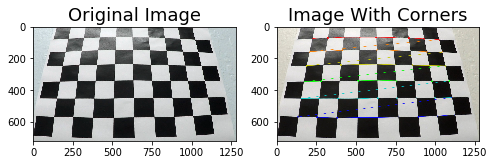
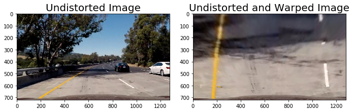

# Project 4: Advanced Lane Line Detection


## Project Goals

The goal of this project is to develop a pipeline to process a video stream from the center camera of a car and output an annotated video which identifies:

1. The positions of the lane lines
2. The location of the vehicle relative to the center of the lane
3. The radius of curvature of the road

The steps that I followed in this project are the following:

**Step 1:** Apply distortion correction using a calculated camera calibration matrix and distortion coefficients.    
**Step 2:** Apply a perspective transformation to warp the image to a birds eye view perspective of the lane lines.    
**Step 3:** Apply color thresholds to create a binary image which isolates the pixels representing lane lines.      
**Step 4:** Identify the lane line pixels and fit polynomials to the lane boundaries.              
**Step 5:** Determine curvature of the lane and vehicle position with respect to center.         
**Step 6:** Warp the detected lane boundaries back onto the original image.                
**Step 7:** Output visual display of the lane boundaries and numerical estimation of lane curvature and vehicle position.         
**Step 8:** Build a video processing pipeline with all the above steps         

I have used the following software/libraries in this project

1. Python 3.5
2. Numpy
3. OpenCV
4. Matplotlib
5. Moviepy

## Detailed explanation of the steps followed

In this section I will go through each of the steps that I followed in this project 

### Step 1: Distortion Correction

In this step, I have used the chessboard images taken at different camera angles provided in **camera_cal** folder to find the imagepoints corresponding to the real world object points using the ```cv2.findChessboardCorners``` function. This imagepoints are used in ```cv2.calibrateCamera``` to derive 

1. camera matrix (Intrinsic Parameters (focal length fx,fy and optical centers cx,cy))
2. Distortion co-efficients (K1,K2, K3 for radial distortion and P1,P2 for tangential distortion)
3. Rotation and translation vectors (Extrinsic Parameters)

These Intrinsic and Extrinsic parameters are used in ```cv2.undistort``` to get an undistored image from the original image

   


### Step 2: Perspective Transformation

In this step I defined a function **hawk_eye_view()** that applies ```cv2.warpPerspective``` to the undistorted image to get a bird's eye view of the road that focuses only on the lane lines and displays them in such a way that they appear to be relatively parallel to eachother. This will make it easier later on to fit polynomials to the lane lines and measure the curvature.

```cv2.warpPerspective``` takes a matrix of four source points on the undistorted image and remaps them to four destination points on the warped image. The source and destination points were selected manually by visualizing the locations of the lane lines on a series of test images.



### Step 3: Apply Color Thresholds

In this step I converted the warped image to a different color space and created binary thresholded images which highlights only the lane lines. The following color spaces and thresholds are working fine for these images in identifying the lane lines.

1. L Channel from LUV color space with a min threshold of 225 and max threshold of 255 is picking up the white lane lines perfectly but completely missing yellow lane lines.

2. B Channel from LAB color space with a min threshold of 155 and max threshold of 200 is picking up the yellow lane lines perfectly but completely missing white lane lines.

Hence I am using a combined binary threshold with a combination of both L channel from LUV and B channel from LAB color space to identify both the lane lines.


### Steps 4,5,6: Fitting a polynomial to the lane lines, calculating vehicle position and radius of curvature

After applying color thresholds for the image, I used the following approach to fit a polynomial for the detected lane line

1. Identified peaks in a histogram of the image to determine location of lane lines.
2. Identified all non zero pixels around histogram peaks using the numpy function ```numpy.nonzero()```
3. Fitted a second order polynomial to each lane using the numpy function ```numpy.polyfit()```

After fitting the polynomials I was able to calculate the position of the vehicle with respect to center with the following calculations:

1. Calculated the average of the x intercepts from each of the two polynomials ```position = (rightx_int+leftx_int)/2```   
2. Calculated the distance from center by taking the absolute value of the vehicle position minus the halfway point along the horizontal axis ```distance_from_center = abs(image_width/2 - position)```   
3. If the horizontal position of the car was greater than image_width/2 than the car was considered to be left of center, otherwise right of center.  
4. Finally, the distance from center was converted from pixels to meters by multiplying the number of pixels by ```3.7/700```

Next I used the following code to calculate the radius of curvature for each lane line in meters:
```
ym_per_pix = 30./720 # meters per pixel in y dimension
xm_per_pix = 3.7/700 # meteres per pixel in x dimension
left_fit_cr = np.polyfit(lefty*ym_per_pix, leftx*xm_per_pix, 2)
right_fit_cr = np.polyfit(righty*ym_per_pix, rightx*xm_per_pix, 2)
left_curverad = ((1 + (2*left_fit_cr[0]*np.max(lefty) + left_fit_cr[1])**2)**1.5) \
                             /np.absolute(2*left_fit_cr[0])
right_curverad = ((1 + (2*right_fit_cr[0]*np.max(lefty) + right_fit_cr[1])**2)**1.5) \
                                /np.absolute(2*right_fit_cr[0])
```

The final radius of curvature was taken by average the left and right curve radiuses.


## [Rubric](https://review.udacity.com/#!/rubrics/571/view) Points

### Here I will consider the rubric points individually and describe how I addressed each point in my implementation.  

---

### Writeup / README

#### 1. Provide a Writeup / README that includes all the rubric points and how you addressed each one.  You can submit your writeup as markdown or pdf.  [Here](https://github.com/udacity/CarND-Advanced-Lane-Lines/blob/master/writeup_template.md) is a template writeup for this project you can use as a guide and a starting point.  

You're reading it!

### Camera Calibration

#### 1. Briefly state how you computed the camera matrix and distortion coefficients. Provide an example of a distortion corrected calibration image.

The code for this step is contained in the first code cell of the IPython notebook located in "./examples/example.ipynb" (or in lines # through # of the file called `some_file.py`).  

I start by preparing "object points", which will be the (x, y, z) coordinates of the chessboard corners in the world. Here I am assuming the chessboard is fixed on the (x, y) plane at z=0, such that the object points are the same for each calibration image.  Thus, `objp` is just a replicated array of coordinates, and `objpoints` will be appended with a copy of it every time I successfully detect all chessboard corners in a test image.  `imgpoints` will be appended with the (x, y) pixel position of each of the corners in the image plane with each successful chessboard detection.  

I then used the output `objpoints` and `imgpoints` to compute the camera calibration and distortion coefficients using the `cv2.calibrateCamera()` function.  I applied this distortion correction to the test image using the `cv2.undistort()` function and obtained this result: 

![alt text][image1]

### Pipeline (single images)

#### 1. Provide an example of a distortion-corrected image.

To demonstrate this step, I will describe how I apply the distortion correction to one of the test images like this one:
![alt text][image2]

#### 2. Describe how (and identify where in your code) you used color transforms, gradients or other methods to create a thresholded binary image.  Provide an example of a binary image result.

I used a combination of color and gradient thresholds to generate a binary image (thresholding steps at lines # through # in `another_file.py`).  Here's an example of my output for this step.  (note: this is not actually from one of the test images)

![alt text][image3]

#### 3. Describe how (and identify where in your code) you performed a perspective transform and provide an example of a transformed image.

The code for my perspective transform includes a function called `warper()`, which appears in lines 1 through 8 in the file `example.py` (output_images/examples/example.py) (or, for example, in the 3rd code cell of the IPython notebook).  The `warper()` function takes as inputs an image (`img`), as well as source (`src`) and destination (`dst`) points.  I chose the hardcode the source and destination points in the following manner:

```python
src = np.float32(
    [[(img_size[0] / 2) - 55, img_size[1] / 2 + 100],
    [((img_size[0] / 6) - 10), img_size[1]],
    [(img_size[0] * 5 / 6) + 60, img_size[1]],
    [(img_size[0] / 2 + 55), img_size[1] / 2 + 100]])
dst = np.float32(
    [[(img_size[0] / 4), 0],
    [(img_size[0] / 4), img_size[1]],
    [(img_size[0] * 3 / 4), img_size[1]],
    [(img_size[0] * 3 / 4), 0]])
```

This resulted in the following source and destination points:

| Source        | Destination   | 
|:-------------:|:-------------:| 
| 585, 460      | 320, 0        | 
| 203, 720      | 320, 720      |
| 1127, 720     | 960, 720      |
| 695, 460      | 960, 0        |

I verified that my perspective transform was working as expected by drawing the `src` and `dst` points onto a test image and its warped counterpart to verify that the lines appear parallel in the warped image.

![alt text][image4]

#### 4. Describe how (and identify where in your code) you identified lane-line pixels and fit their positions with a polynomial?

Then I did some other stuff and fit my lane lines with a 2nd order polynomial kinda like this:

![alt text][image5]

#### 5. Describe how (and identify where in your code) you calculated the radius of curvature of the lane and the position of the vehicle with respect to center.

I did this in lines # through # in my code in `my_other_file.py`

#### 6. Provide an example image of your result plotted back down onto the road such that the lane area is identified clearly.

I implemented this step in lines # through # in my code in `yet_another_file.py` in the function `map_lane()`.  Here is an example of my result on a test image:

![alt text][image6]

---

### Pipeline (video)

#### 1. Provide a link to your final video output.  Your pipeline should perform reasonably well on the entire project video (wobbly lines are ok but no catastrophic failures that would cause the car to drive off the road!).

Here's a [link to my video result](./project_video.mp4)

---

### Discussion

#### 1. Briefly discuss any problems / issues you faced in your implementation of this project.  Where will your pipeline likely fail?  What could you do to make it more robust?

Here I'll talk about the approach I took, what techniques I used, what worked and why, where the pipeline might fail and how I might improve it if I were going to pursue this project further.  
